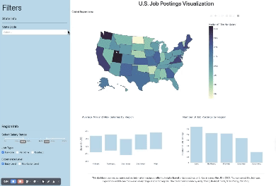

# Dashboard of LinkedIn Job Postings in the US (2023)

This project is about making a dashboard of LinkedIn job postings in the US in 2023.

[](https://www.repostatus.org/#active) [](https://www.python.org/downloads/release/python-390/)[](https://opensource.org/licenses/MIT)

## 📖 The Problem

Finding suitable opportunities in the job market can be daunting for job seekers as they have to sift through large amounts of data to find suitable opportunities that match their target positions, salary expectation ranges and ideal working locations. Such difficulties are usually encountered by career advisor and human resources analyst as well. The key challenge is the complexity and time-consuming nature of processing and understanding large amounts of job market data, which can lead to missed opportunities and unsatisfactory career decisions.

## 💡 The Solution

Our dashboard serves as a personalized job market navigator, offering insights based on job postings on Linkedin across the US in 2023. It provides job seekers, career advisor and human resources analyst with a clear and interactive overview of the job landscape, enabling them to have a basic mindset on the US job market based on salary range, job type, and regions for different positions.

## 💻 Usage

{width="414"}

### Dashboard

Visit the [Job Postings Dashboard](https://dsci-532-2024-21-job-postings.onrender.com/) for our dashboard directly!

### Developer Guide

1.  Clone the repository

``` bash
git clone git@github.com:UBC-MDS/DSCI-532_2024_21_Job-Postings.git
```

2.  Create the virtual environment

``` bash
conda env create -f environment.yaml
conda activate 532_group_21
```

3.  Set to `debug=True` in `src/app.py` for the development

``` python
if __name__ == "__main__":
    app.run(debug=True)
```

4.  Render the dashboard

``` bash
python -m src.app
```

## 👥 Contributors

[\@andyzhangstat](https://github.com/andyzhangstat) [\@Owl64901](https://github.com/Owl64901) [\@Prabh95](https://github.com/Prabh95) [\@sifanzzz](https://github.com/sifanzzz)

## 🖇 Contributing

Interested in contributing? Check out the [contributing guidelines](https://github.com/UBC-MDS/DSCI-532_2024_21_Job-Postings/blob/main/CONTRIBUTING.md). Please note that this project is released with a Code of Conduct. By contributing to this project, you agree to abide by its terms.

## 📚 License

## Support
<TBD>

The Job Postings dashboard is licensed under the terms of the [MIT license](https://github.com/UBC-MDS/DSCI-532_2024_21_Job-Postings/blob/main/LICENSE).

## ✏️ Reference

Data resource: [LinkedIn Job Postings - 2023](https://www.kaggle.com/datasets/arshkon/linkedin-job-postings)
