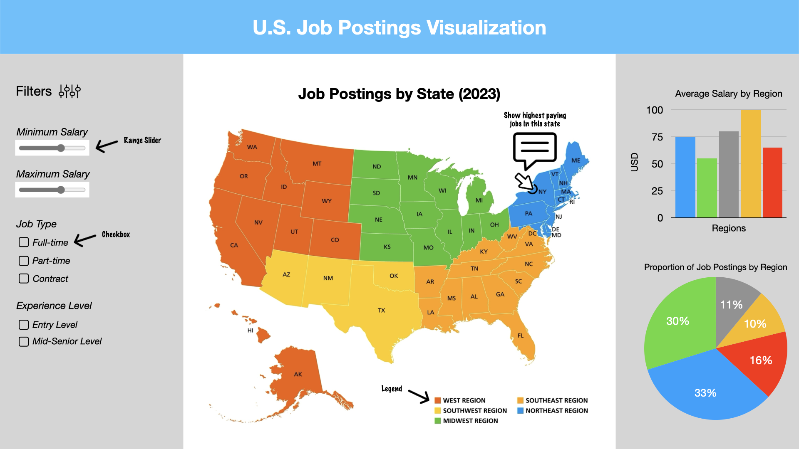

# Milestone 1 - Team 21

## Proposal

### 1. Motivation and purpose

Our role: Career Insights and Job Market Analytics Provider

Target audience: Job Seekers in the US

Finding suitable opportunities in the job market can be daunting for job seekers as they have to sift through large amounts of data to find suitable opportunities that match their target positions, salary expectation ranges and ideal work locations. The key challenge is the complexity and time-consuming nature of processing and understanding large amounts of job market data, which can lead to missed opportunities and unsatisfactory career decisions. Addressing this issue is crucial to enhancing job seekers' ability to quickly identify and process the most relevant job offers.

Our dashboard serves as a personalized job market navigator, offering basic insights into job postings across the US for 2023. It provides job seekers with a clear and interactive overview of the job landscape, enabling them to filter opportunities based on salary range, job type, and target regions. The regional analysis features, such as average salary by region and the proportion of job postings, equip job seekers with the knowledge to target their search geographically. By utilizing this dashboard, job seekers can efficiently have an overall understanding of their pinpoint roles, which can serve as reference for their future searching.

### 2. Description of the data

### 3. Research questions

### 4. App sketch and description

The app provides a user-friendly dashboard to explore U.S. job postings, featuring a dynamic map and comprehensive filtering options. Users can adjust salary ranges through sliders and specify the type of job and experience level via checkboxes to tailor the job search. The map offers a color-coded view of job postings by region, with a clickable feature for pinpointing the highest-paying opportunities in each state. On the right side, bar and pie charts display the average salary by region and the proportion of job postings by region, respectively, updating in real-time to reflect changes made through the filters. This interactive platform is designed for simplicity, ensuring that users can seamlessly navigate through different data visualizations to gain insights into the U.S. job market.
